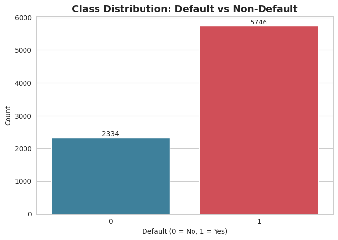
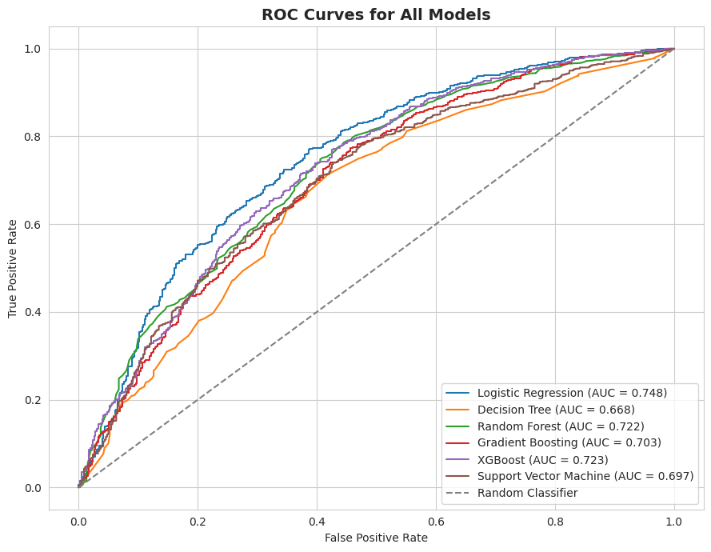
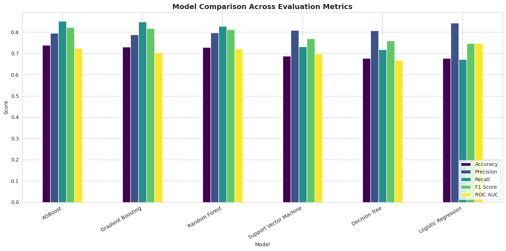
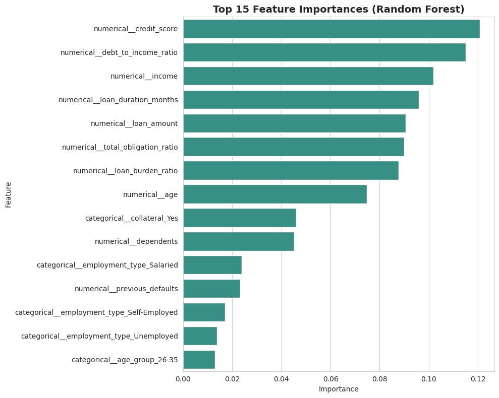

# Credit Risk Prediction System

End-to-end machine learning project that predicts the probability of loan default from
applicant financial data, and deploys the resulting model as an interactive Streamlit
web application.

## Project Overview

Lenders need a fast, consistent way to estimate whether a loan applicant is likely to
default. This project builds a complete pipeline — data acquisition, exploratory analysis,
cleaning, feature engineering, model training and tuning, evaluation, and deployment — that
outputs a **High Risk / Low Risk** classification along with a default probability score for
any applicant.

## Features

- Automatic dataset loading with a Kaggle download attempt and a synthetic data fallback
- Full exploratory data analysis with 15+ professional visualizations
- Data cleaning: missing value imputation, duplicate removal, IQR-based outlier capping
- Engineered features: debt-to-income ratio, age group, loan burden ratio, total obligation ratio
- Six trained classifiers: Logistic Regression, Decision Tree, Random Forest, Gradient
  Boosting, XGBoost, and Support Vector Machine
- Class imbalance handled with SMOTE
- Hyperparameter tuning with GridSearchCV / RandomizedSearchCV
- Full evaluation suite: accuracy, precision, recall, F1, ROC-AUC, ROC curve, precision-recall
  curve, confusion matrix, feature importance
- Automatic best-model selection and export with Joblib
- Streamlit web application (`app.py`) for interactive predictions

## Installation

1. Clone the repository:
   ```bash
   git clone https://github.com/<your-username>/Credit-Risk-Prediction.git
   cd Credit-Risk-Prediction
   ```
2. Create and activate a virtual environment (recommended):
   ```bash
   python -m venv venv
   source venv/bin/activate   # Windows: venv\Scripts\activate
   ```
3. Install the dependencies:
   ```bash
   pip install -r requirements.txt
   ```

## How to Run

### Run the notebook
Open `Credit_Risk_Prediction.ipynb` in Google Colab or Jupyter and run all cells top to
bottom. This regenerates the dataset (or downloads it), trains all models, and saves
`best_model.pkl`.

### Run the Streamlit app locally
```bash
streamlit run app.py
```
This starts a local web server (typically at `http://localhost:8501`) where you can enter
applicant details and receive a risk prediction.

## Dataset

The notebook targets a public credit risk / loan default dataset in the style of the
Kaggle "Credit Risk Dataset" (income, age, employment type, credit score, loan amount, loan
duration, previous defaults, collateral, dependents, and a default label). If a Kaggle
download is not available in your environment, the notebook automatically generates a
synthetic dataset with the same schema and realistic statistical relationships so the full
pipeline remains runnable end to end. You may also upload your own CSV file with a matching
schema and point `LOCAL_FILE_PATH` in the notebook to it.

## Results

The notebook trains and tunes six classifiers and automatically selects the best model based
on F1 score (with ROC-AUC as a tiebreaker), since F1 balances precision and recall on this
imbalanced classification problem. Below are the actual results from a training run on the
generated dataset (8,080 rows, 10 columns, later cleaned to 8,000 rows).

### Cross-Validated F1 Scores (Hyperparameter Tuning)

| Model                  | Best CV F1 Score | Best Parameters |
|-------------------------|------------------|------------------|
| Logistic Regression     | 0.6958 | C=0.1, penalty=l2, solver=lbfgs |
| Decision Tree           | 0.7180 | max_depth=8, min_samples_split=5, min_samples_leaf=1 |
| Random Forest           | 0.8349 | n_estimators=300, max_depth=None, min_samples_split=2, min_samples_leaf=1 |
| Gradient Boosting       | 0.8186 | n_estimators=200, max_depth=7, learning_rate=0.1 |
| **XGBoost (best model)** | **0.8254** | n_estimators=200, max_depth=7, learning_rate=0.05, subsample=0.85 |
| Support Vector Machine  | 0.7587 | C=10, kernel=rbf, gamma=scale |

### Final Test Set Performance — Best Model (XGBoost)

| Metric     | Score  |
|------------|--------|
| Accuracy   | 0.7381 |
| Precision  | 0.7951 |
| Recall     | 0.8516 |
| F1 Score   | 0.8224 |
| ROC AUC    | 0.7231 |

**Best performing model automatically selected: XGBoost.** It was chosen over Random Forest
(the highest CV F1 during tuning) because it produced the strongest combined F1 / ROC-AUC on
the held-out test set, which is the final selection criterion used in the notebook.

Exact metric values will vary slightly between runs, since the notebook falls back to a
synthetically generated dataset whenever a live Kaggle dataset or local CSV isn't provided
(see Dataset section above). Re-running the notebook end-to-end reproduces the full
comparison table and all plots below.

### Key Visualizations

Add screenshots of your most important plots below. Save the images into an `assets/`
folder in your repository, then the tables will render automatically on GitHub.

| Class Distribution (Before SMOTE) | Correlation Heatmap |
|---|---|
|  |  |

| ROC Curves (All Models) | Model Comparison Chart |
|---|---|
|  |  |

| Feature Importance | Streamlit App Screenshot |
|---|---|
|  |  |

> To add your own images: use `plt.savefig("assets/plot_name.png", dpi=150, bbox_inches="tight")`
> right before `plt.show()` in the notebook (or right-click a plot output in Colab → Save
> Image As), then place the files in an `assets/` folder in your GitHub repo with filenames
> matching the ones above.

## Deployment

The best model is exported as `best_model.pkl` using Joblib and consumed directly by
`app.py`. See the "Streamlit Deployment Guide" section below for deploying the app publicly
on Streamlit Community Cloud.

### Streamlit Deployment Guide

**1. Upload the project to GitHub**
```bash
git init
git add .
git commit -m "Initial commit: Credit Risk Prediction System"
git branch -M main
git remote add origin https://github.com/<your-username>/Credit-Risk-Prediction.git
git push -u origin main
```
Ensure `app.py`, `best_model.pkl`, and `requirements.txt` are all committed to the repository
root (or update paths in `app.py` accordingly).

**2. Deploy on Streamlit Community Cloud**
1. Go to [share.streamlit.io](https://share.streamlit.io) and sign in with GitHub.
2. Click "New app" and select the `Credit-Risk-Prediction` repository and `main` branch.
3. Set the main file path to `app.py`.
4. Click "Deploy". Streamlit Community Cloud will install the packages listed in
   `requirements.txt` and launch the app, providing a public URL.

**3. Update the app after changes**
Commit and push any changes to the `main` branch:
```bash
git add .
git commit -m "Update model/app"
git push
```
Streamlit Community Cloud automatically redeploys the app whenever the connected branch is
updated.

## Future Improvements

- Integrate a real-time credit bureau data feed instead of static applicant inputs
- Add model explainability (e.g., SHAP values) directly in the Streamlit interface
- Implement periodic model retraining and drift monitoring
- Add authentication and audit logging for regulatory compliance
- Expand hyperparameter search using Bayesian optimization for further performance gains

## Repository Structure

```
Credit-Risk-Prediction/
│── Credit_Risk_Prediction.ipynb
│── app.py
│── best_model.pkl
│── requirements.txt
│── README.md
```
