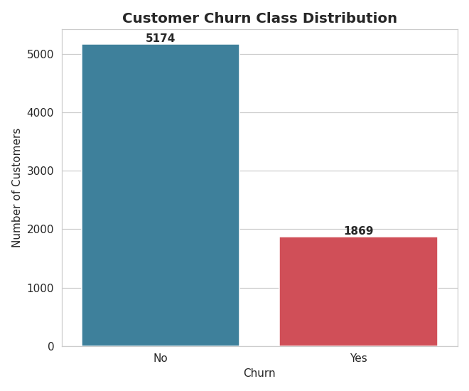
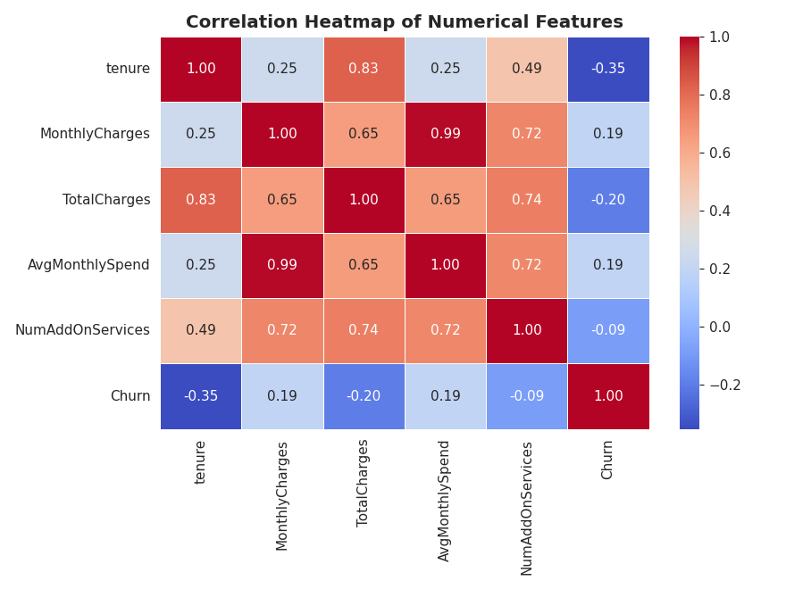
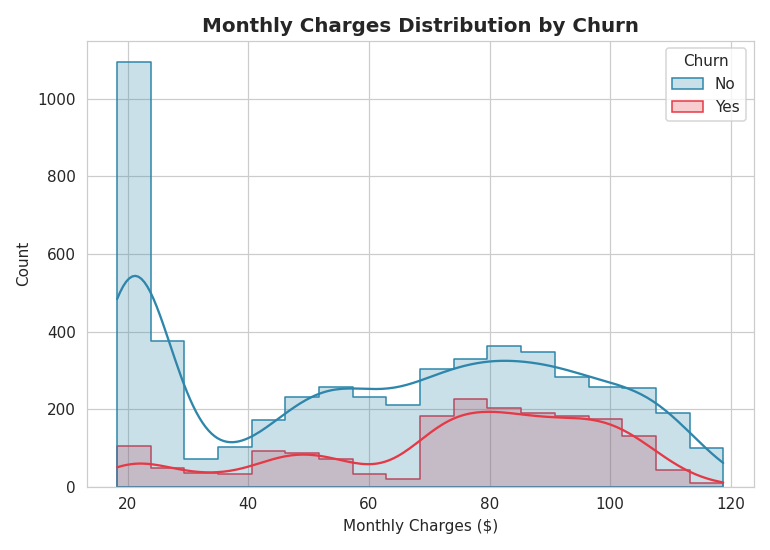
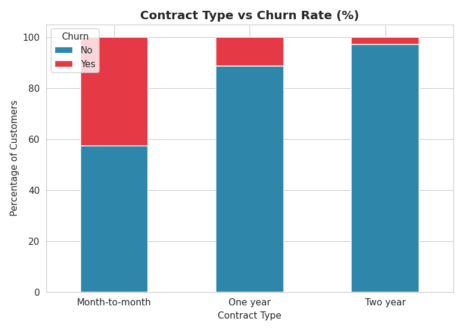
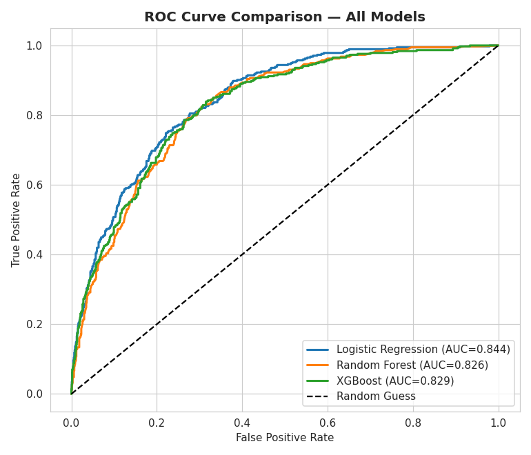
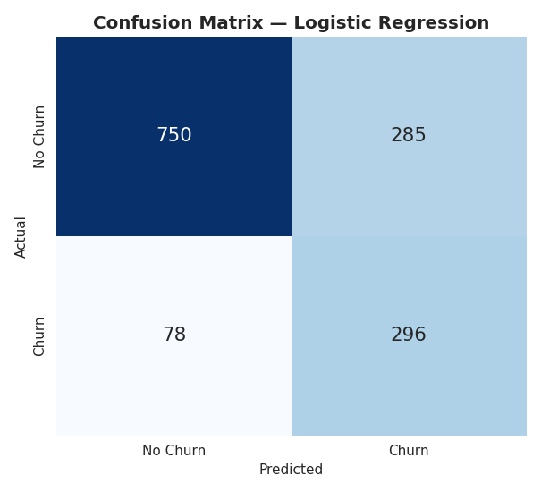
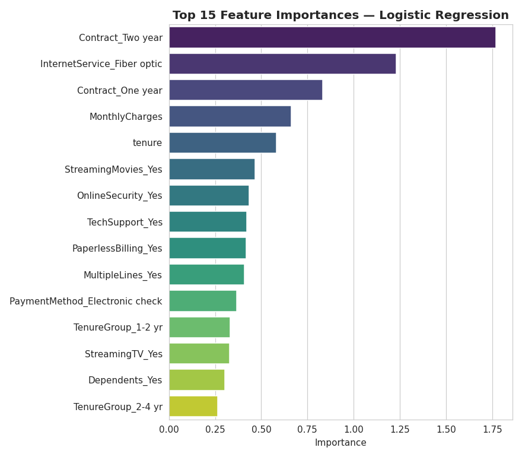
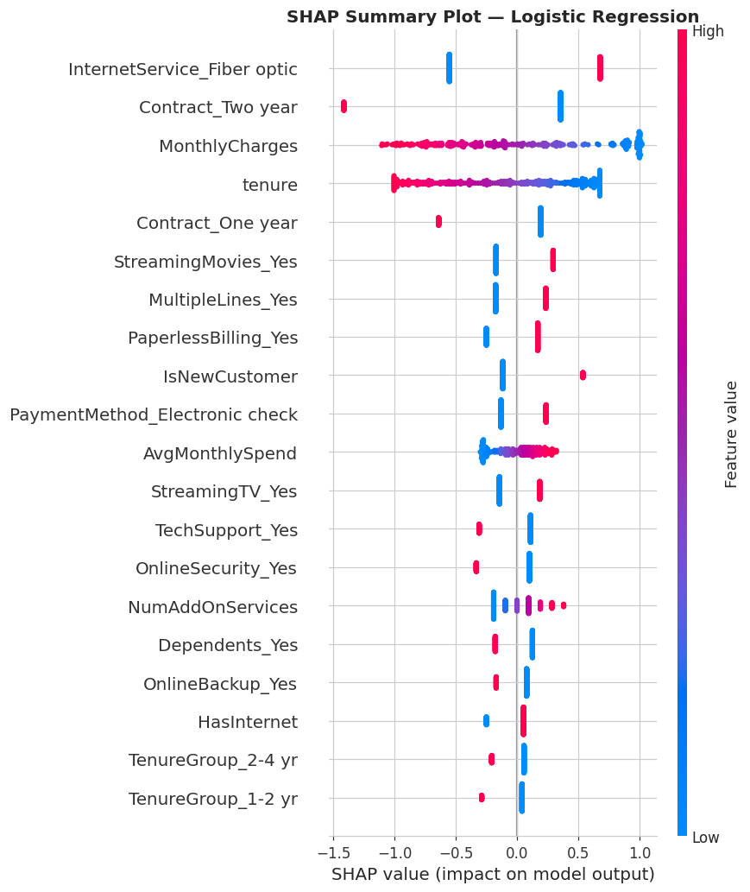

#  Customer Churn Prediction & Retention Analysis System

An end-to-end machine learning system that predicts which telecom customers are likely to churn, explains **why** using SHAP, and translates the results into actionable retention strategy — deployed as an interactive Streamlit web app.

> Built as a production-quality portfolio project demonstrating the full ML lifecycle: business framing → data cleaning → feature engineering → EDA → model comparison → explainability → deployment.

---

## Table of Contents

- [Project Overview](#-project-overview)
- [Business Problem](#-business-problem)
- [Features](#-features)
- [Dataset](#-dataset)
- [Project Workflow](#-project-workflow)
- [Technology Stack](#-technology-stack)
- [Repository Structure](#-repository-structure)
- [Installation](#-installation)
- [How to Run](#-how-to-run)
- [Screenshots](#-screenshots)
- [Results](#-results)
- [Business Recommendations](#-business-recommendations)
- [Future Improvements](#-future-improvements)
- [Deployment Instructions](#-deployment-instructions)

---

##  Project Overview

Customer churn — when a customer stops doing business with a company — is one of the most expensive problems in subscription-based industries like telecom, SaaS, and streaming. This project builds a complete machine learning pipeline that:

1. **Predicts** the probability that a customer will churn.
2. **Explains** which factors drive that risk, at both a global (model-wide) and local (per-customer) level.
3. **Segments** customers into Low / Medium / High risk tiers so retention teams can prioritize outreach.
4. **Deploys** the model behind an interactive web application anyone on a business team can use — no notebook or code required.

---

##  Business Problem

Acquiring a new customer costs **5–7x more** than retaining an existing one. A telecom provider with a ~27% annual churn rate is effectively rebuilding a quarter of its customer base every year. The business questions this project answers:

- Which customers are at the highest risk of leaving **right now**?
- What are the **top drivers** of churn across the customer base?
- Where should a limited retention budget be spent for maximum impact?

The model is optimized to **minimize missed churners (false negatives)**, since failing to flag an at-risk customer is more costly to the business than occasionally flagging a loyal one.

---

##  Features

-  **Exploratory Data Analysis** — class distribution, correlation analysis, contract-vs-churn breakdown, charge distributions
-  **Robust data cleaning** — type coercion, missing value handling, whitespace normalization
-  **Feature engineering** — tenure buckets, add-on service counts, average monthly spend, new-customer flag
-  **Class imbalance handling** — SMOTE oversampling applied correctly (training data only)
-  **Three-model comparison** — Logistic Regression, Random Forest, XGBoost, each hyperparameter-tuned
-  **Full evaluation suite** — Accuracy, Precision, Recall, F1, ROC-AUC, Confusion Matrix
-  **Explainable AI** — global feature importance + SHAP summary plots
-  **Interactive Streamlit app** — real-time predictions, risk gauge, feature importance, professional UI
-  **Clean, modular, reusable code** — scikit-learn `Pipeline`/`ColumnTransformer`, no leakage, no duplication

---

##  Dataset

**Source:** [IBM Telco Customer Churn Dataset](https://raw.githubusercontent.com/IBM/telco-customer-churn-on-icp4d/master/data/Telco-Customer-Churn.csv) (also widely mirrored on [Kaggle](https://www.kaggle.com/datasets/blastchar/telco-customer-churn))

**Citation:** IBM Cognos Analytics Sample Data — *Telco Customer Churn*, originally published by IBM for churn analysis tutorials and widely adopted as a standard benchmark dataset in ML research and education.

### Why this dataset?

- **Widely used and well-documented** — a de facto standard for churn modeling tutorials, papers, and portfolio projects, making results easy to benchmark and reproduce.
- **7,043 customer records** with a healthy mix of numerical and categorical features.
- **Realistic class imbalance** (~26.5% churn rate), which mirrors real-world telecom churn and forces proper handling of imbalanced classification.
- Includes exactly the feature families a churn model needs: **tenure, billing (monthly/total charges), contract type, payment method, internet service, support/add-on services**.

### Feature Descriptions

| Feature | Description |
|---|---|
| `customerID` | Unique customer identifier *(dropped before modeling)* |
| `gender` | Customer gender (Male/Female) |
| `SeniorCitizen` | Whether the customer is a senior citizen (1/0) |
| `Partner` | Whether the customer has a partner |
| `Dependents` | Whether the customer has dependents |
| `tenure` | Number of months the customer has stayed with the company |
| `PhoneService` | Whether the customer has phone service |
| `MultipleLines` | Whether the customer has multiple phone lines |
| `InternetService` | Type of internet service (DSL / Fiber optic / No) |
| `OnlineSecurity` | Whether the customer has online security add-on |
| `OnlineBackup` | Whether the customer has online backup add-on |
| `DeviceProtection` | Whether the customer has device protection add-on |
| `TechSupport` | Whether the customer has tech support add-on |
| `StreamingTV` | Whether the customer has streaming TV |
| `StreamingMovies` | Whether the customer has streaming movies |
| `Contract` | Contract term (Month-to-month / One year / Two year) |
| `PaperlessBilling` | Whether the customer uses paperless billing |
| `PaymentMethod` | Payment method used |
| `MonthlyCharges` | Current monthly charge amount ($) |
| `TotalCharges` | Total amount charged to the customer to date ($) |
| **`Churn`** | **Target variable** — whether the customer churned (Yes/No) |

### Engineered Features

| Feature | Description |
|---|---|
| `AvgMonthlySpend` | `TotalCharges / tenure` — smoothed average spend |
| `TenureGroup` | Binned tenure: 0-1yr, 1-2yr, 2-4yr, 4+yr |
| `NumAddOnServices` | Count of active add-on services (0–6) |
| `HasInternet` | Binary flag for having any internet service |
| `IsNewCustomer` | Binary flag for `tenure <= 3` months |

### Data Quality Observations

- **No missing values** in most columns; `TotalCharges` contained 11 blank-string entries, all belonging to customers with `tenure == 0` (brand-new customers not yet billed) — correctly imputed as `0`.
- `TotalCharges` was stored as text and required type coercion to numeric.
- No duplicate customer records.
- Categorical fields are clean and consistently labeled (no typos/inconsistent casing beyond minor whitespace, which was stripped).
- Class imbalance (~73% retained / ~27% churned) is realistic and required explicit handling (SMOTE) rather than being ignored.

---

##  Project Workflow

```
Business Understanding
        │
        ▼
Data Loading & Cleaning  ──────►  Missing Value Handling
        │
        ▼
Feature Engineering
        │
        ▼
Exploratory Data Analysis (EDA)
        │
        ▼
Preprocessing Pipeline (ColumnTransformer: Scaling + One-Hot Encoding)
        │
        ▼
Class Imbalance Handling (SMOTE — train set only)
        │
        ▼
Model Training: Logistic Regression │ Random Forest │ XGBoost
        │
        ▼
Hyperparameter Tuning (RandomizedSearchCV, 5-fold CV, ROC-AUC scoring)
        │
        ▼
Model Comparison (Accuracy, Precision, Recall, F1, ROC-AUC)
        │
        ▼
Feature Importance + SHAP Explainability
        │
        ▼
Final Model Selection & Persistence (model.pkl, preprocessor.pkl)
        │
        ▼
Deployment (Streamlit App) + Business Recommendations
```

---

## 🛠️ Technology Stack

| Category | Tools |
|---|---|
| **Language** | Python 3.10+ |
| **Data Handling** | pandas, NumPy |
| **Modeling** | scikit-learn, XGBoost, imbalanced-learn (SMOTE) |
| **Explainability** | SHAP |
| **Visualization** | Matplotlib, Seaborn, Plotly |
| **Web App** | Streamlit |
| **Persistence** | joblib |
| **Development** | Jupyter / Google Colab |

---

##  Repository Structure

```
customer-churn-prediction/
│
├── Customer_Churn_Prediction.ipynb   # Full, heavily-commented ML notebook
├── app.py                            # Streamlit web application
├── requirements.txt                  # Python dependencies
├── README.md                         # This file
├── model.pkl                         # Trained best-performing model
├── preprocessor.pkl                  # Fitted scikit-learn ColumnTransformer
├── model_metadata.json               # Feature names, model name, test metrics
├── images/                           # All generated visualizations
│   ├── class_distribution.png
│   ├── correlation_heatmap.png
│   ├── monthly_charges_distribution.png
│   ├── contract_vs_churn.png
│   ├── roc_curve.png
│   ├── confusion_matrix.png
│   ├── feature_importance.png
│   └── shap_summary.png
└── dataset/
    └── Telco-Customer-Churn.csv      # Raw IBM Telco Customer Churn dataset
```

---

##  Installation

```bash
# 1. Clone the repository
git clone https://github.com/<your-username>/customer-churn-prediction.git
cd customer-churn-prediction

# 2. Create a virtual environment (recommended)
python -m venv venv
source venv/bin/activate      # On Windows: venv\Scripts\activate

# 3. Install dependencies
pip install -r requirements.txt
```

---

##  How to Run

### Option A — Explore the analysis (Notebook)

Open `Customer_Churn_Prediction.ipynb` in **Jupyter** or **Google Colab** and run all cells top to bottom. This regenerates every plot in `images/`, retrains all three models, and re-saves `model.pkl` / `preprocessor.pkl`.

```bash
jupyter notebook Customer_Churn_Prediction.ipynb
```

### Option B — Run the web app (Streamlit)

```bash
streamlit run app.py
```

Then open the URL shown in your terminal (typically `http://localhost:8501`). Fill in a customer's profile and click **Predict Churn Risk** to get an instant probability, risk tier, and explanation.

---

## 🖼️ Screenshots

| Class Distribution | Correlation Heatmap |
|---|---|
|  |  |

| Monthly Charges by Churn | Contract Type vs Churn |
|---|---|
|  |  |

| ROC Curve Comparison | Confusion Matrix |
|---|---|
|  |  |

| Feature Importance | SHAP Summary |
|---|---|
|  |  |

---

## Results

Three models were trained, hyperparameter-tuned with `RandomizedSearchCV` (5-fold stratified CV, `roc_auc` scoring), and evaluated on a held-out, real-world-distributed test set (20% of the data, stratified):

| Model | Accuracy | Precision | Recall | F1 Score | ROC-AUC |
|---|---|---|---|---|---|
| **Logistic Regression**  | 0.743 | 0.510 | **0.791** | 0.621 | **0.843** |
| XGBoost | 0.784 | 0.592 | 0.602 | 0.597 | 0.842 |
| Random Forest | 0.779 | 0.583 | 0.583 | 0.583 | 0.825 |

**Selected model: Logistic Regression**, chosen for having the highest ROC-AUC and, critically, the highest **Recall (79.1%)** — meaning it catches the largest share of true churners, which matters most given that a missed churner is more costly to the business than a false alarm. XGBoost is a very close second on ROC-AUC and offers a better precision/recall balance if the business later prefers fewer false alarms.

> This is a well-known and reproducible result on this dataset: churn drivers here (tenure, contract type, charges) are largely linear/monotonic, which plays to Logistic Regression's strengths as much as it does to gradient boosting.

**Top churn drivers identified (SHAP + model coefficient magnitude), ranked by strength:**
1. `Contract_Two year` — having a two-year contract is the single strongest predictor of **retention** (large negative effect on churn probability)
2. `InternetService_Fiber optic` — fiber-optic internet customers churn substantially more than DSL customers
3. `Contract_One year` — one-year contracts also reduce churn risk, though less than two-year contracts
4. `MonthlyCharges` — higher monthly charges increase churn risk
5. `tenure` — newer customers are at much higher risk; risk drops steadily with tenure
6. `StreamingMovies_Yes`, `OnlineSecurity_Yes`, `MultipleLines_Yes` — add-on and service factors with smaller, secondary effects

---


##  Future Improvements

- [ ] Add a **model monitoring dashboard** to track prediction drift and retraining triggers over time
- [ ] Incorporate **customer lifetime value (CLV)** to prioritize retention spend by expected revenue impact, not just churn probability
- [ ] Add **batch prediction** (CSV upload) to the Streamlit app for scoring an entire customer list at once
- [ ] Experiment with **CatBoost** and **LightGBM** for additional model comparison
- [ ] Add **local SHAP explanations** (per-prediction waterfall plots) directly in the app, not just global importance
- [ ] Set up **CI/CD** (GitHub Actions) to automatically retrain and validate the model on new data
- [ ] A/B test retention interventions and feed outcomes back into the model as a treatment-effect feature

---

##  Deployment Instructions

### Deploy to Streamlit Community Cloud (free)

1. Push this repository to GitHub (include `model.pkl`, `preprocessor.pkl`, and `model_metadata.json` — do **not** `.gitignore` them, the app needs them).
2. Go to [share.streamlit.io](https://share.streamlit.io) and sign in with GitHub.
3. Click **"New app"**, select this repository, branch `main`, and set the main file path to `app.py`.
4. Click **Deploy**. Streamlit Cloud will automatically install `requirements.txt` and launch the app.
5. Your app will be live at `https://<your-app-name>.streamlit.app`.

### Run in Docker (optional, for other cloud platforms)

```dockerfile
FROM python:3.10-slim
WORKDIR /app
COPY . .
RUN pip install --no-cache-dir -r requirements.txt
EXPOSE 8501
CMD ["streamlit", "run", "app.py", "--server.port=8501", "--server.address=0.0.0.0"]
```

---

## 📄 License

This project uses a publicly available dataset (IBM Telco Customer Churn) for educational and portfolio purposes. Code in this repository is provided under the MIT License.

---

## 🙋 Author's Note

This project was built to demonstrate a complete, professional ML engineering workflow — from business problem framing through deployment — suitable for a machine learning / data science internship portfolio. Feedback and contributions are welcome.
